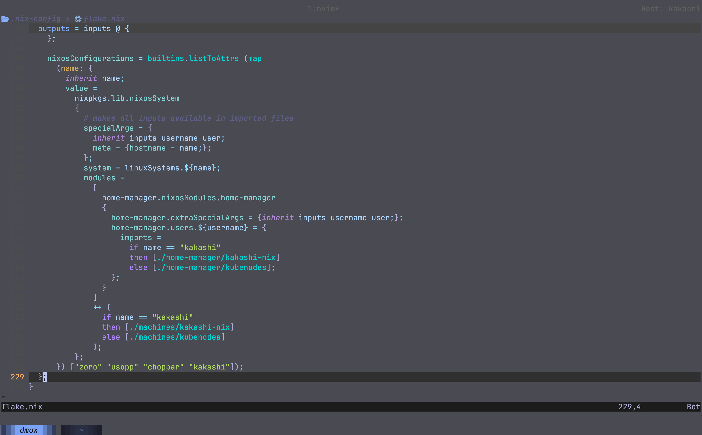
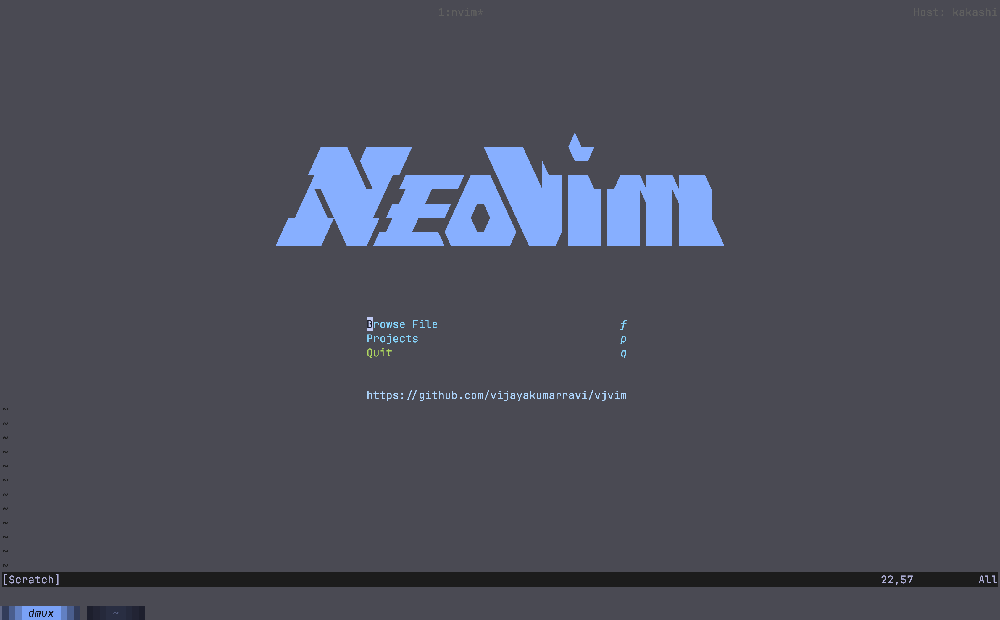
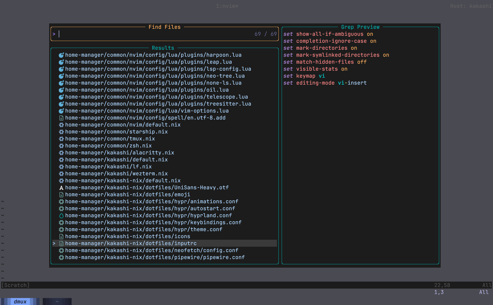

<div align="center">
    
 <a href="https://git.io/typing-svg"></a>
    
</div>

<h1 align="center"> Nixvim-based Neovim configuration </h1>



<details>
    <summary>More</summary>
    
    
</details>

## Configuring

To start configuring, just add or modify the nix files in `./config`.
If you add a new configuration file, remember to add it to the
[`config/default.nix`](../config/default.nix) file

  ## Testing your new configuration

To test your configuration simply run the following command

```shell
nix run .
```

If you have nix installed, you can directly run my config from anywhere

You can try running mine with:

```shell
nix run 'github:vijayakumarravi/vjvim'
```

## Installing into NixOS configuration

This `nixvim` flake will output a derivation that you can easily include
in either `home.packages` for `home-manager`, or
`environment.systemPackages` for `NixOS`. Or whatever happens with darwin?

You can add my `nixvim` configuration as an input to your `NixOS` configuration like:

```nix
{
 inputs = {
    nixvim.url = "github:vijayakumarravi/vjvim";
 };
}
```

### Direct installation

With the input added you can reference it directly.

```nix
{ inputs, system, ... }:
{
  # NixOS
  environment.systemPackages = [ inputs.nixvim.packages.${pkgs.system}.default ];
  # home-manager
  home.packages = [ inputs.nixvim.packages.${pkgs.system}.default ];
}
```

The binary built by `nixvim` is already named as `nvim` so you can call it just
like you normally would.

### Installing as an overlay

Another method is to overlay your custom build over `neovim` from `nixpkgs`.

This method is less straight-forward but allows you to install `neovim` like
you normally would. With this method you would just install `neovim` in your
configuration (`home.packges = with pkgs; [ neovim ]`), but you replace
`neovim` in `pkgs` with your derivation from `nixvim`.

```nix
{
  pkgs = import inputs.nixpkgs {
    overlays = [
      (final: prev: {
        neovim = inputs.nixvim.packages.${pkgs.system}.default;
      })
    ];
  }
}
```

### Bonus lazy method

You can just straight up alias something like `nix run
'github:vijayakumarravi/vjvim'` to `nvim` or `vi` or `vim`.

## Credits

* Thanks to [webmessia-h/nixvi](https://github.com/webmessia-h/nixvi) 